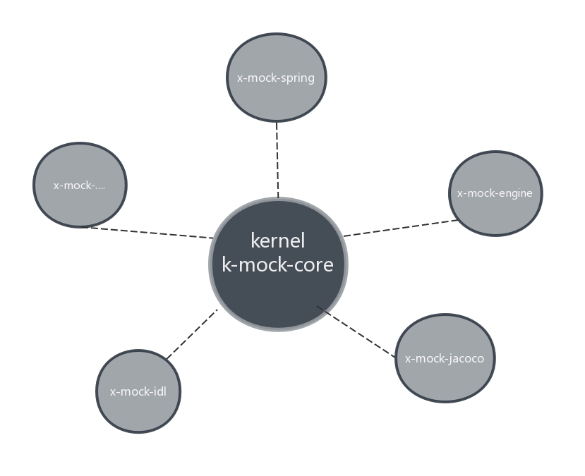

##杂谈
* 目前网上UT框架很多、如jmockit、powermock、mockito等。功能丰富，支持的场景也多。总的来说功能丰富意味着学习成本高，需要熟悉各种函数这、注解及其使用。x-mock的优势在于使用简单，配置更简单。
对于UT来说，我们还需要代码覆盖率统计功能。通常的做法就是引入第三方框架如:EMMA、JaCoCo等,而x-mock天然支持jacoco，不管是maven还是gradle的项目都能支持。不需要用户做过多的配置。
仅仅只需要引入一个jar就能获得mock和代码覆盖率的能力。此外，x-mock兼容Spring容器，对mock的目标对象所依赖的bean,能够自动填充为spring bean。用户仅仅关注mock的部分就好。
x-mock最大的不同就是通过配置的方式进行mock。录制配置脚本的方式更加灵活，和代码进行解偶。

##技术栈
* java agent
* 字节码修改javassist
* 反射
* spi扩展点

##设计原则
* Micro kernel+plug-in
    *   k-mock-core为核心，不做具体业务操作。仅仅对各个插件进行调度管理、生命周期的编排工作。实际业务操作由各插件实现。
        每个插件都是独立存在,可以灵活做到加载、替换。

    *  x-mock当前具有4个扩展点（CodeCoverage,Describable,Engine,IOCcontainer），用户可以通过扩展点编写自己的插件。
       插件实现原则：需要编写某个插件，则需要在资源文件下创建META/xspi/org.xiong.xmock.api.XXX (XXX代表某个插件)文件。
       文件内容 eg:
              name=mock-engine   //插件名称
              value=org.xiong.xmock.engine.EngineMain   //插件实现类
              ordered=100  //加载优先级。 可选的。 值越小，优先加载。
* 

##有问题反馈
在使用中有任何问题，欢迎反馈给我，可以用以下联系方式跟我交流

* 邮件414280722#qq.com, 把#换成@)