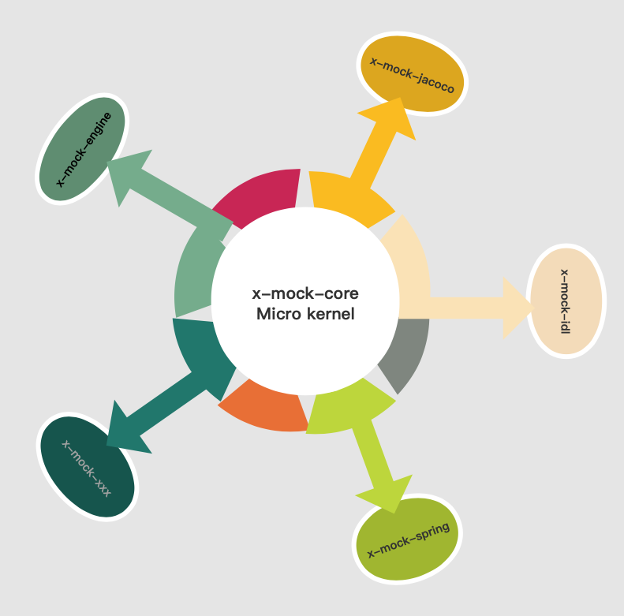

##杂谈
* x-mock也是一个单元测试模拟框架，它是在junit单元测试的基础上做出的扩展。当前也有PowerMock这样的mock工具。一般它会搭配Mockito来完成UT。而x-mock不同之处是基于配置文件的方式进行mock，录制配置脚本的方式更加灵活，和代码进行解偶，使用非常简单。
  
  另外，一般引入的三方jar,有可能会造成业务方jar包的冲突。x-mock的实现中已经消除了这种隐患,内部实现了嵌套jar的加载。
  
  对于UT来说，我们还需要代码覆盖率统计功能。通常的做法就是引入第三方框架如:EMMA、JaCoCo等,而x-mock天然支持jacoco，不管是maven还是gradle的项目都能支持。不需要用户做过多的配置。仅仅只需要引入一个jar就能获得mock和代码覆盖率的能力。
  
  x-mock兼容Spring容器，对mock的目标对象所依赖的bean,能够自动填充为spring bean。用户仅仅关注mock的部分就好。

##技术点
* java agent
* 字节码修改javassist
* 反射
* spi扩展点
* 嵌套jar class加载

##特性
* 1、基于yaml配置文件录制mock脚本。
* 2、支持目标对象方法的mock,而对象所依赖的bean默认为原始引用,无需手工填充。
* 3、支持private、static、final等方法mock。
* 4、支持interface mock,可模拟三方接口调用时长。
* 5、可模拟接口调用异常。 如:RuntimeException、SocketTimeoutException
* 6、采用nested jar加载模式。完全消除对业务方jar的冲突。

##设计原则
* Micro kernel+plug-in
    *   x-mock-core为核心，不做具体业务操作。仅仅对各个插件进行调度管理、生命周期的编排工作。实际业务操作由各插件实现。
        每个插件都是独立存在,可以灵活做到加载、替换。(xmock.load.exclude 指定不被加载的插件。多个,隔开)

    *  x-mock当前具有4个扩展点（CodeCoverage,Describable,Engine,IOCcontainer），用户可以通过扩展点编写自己的插件。
       插件实现原则：
       *  编写某个插件，则需要在资源文件下创建META-INF/xspi/org.xiong.xmock.api.XXX (XXX代表某个插件)文件。
          文件内容 eg:
              name=mock-engine   //插件名称
              value=org.xiong.xmock.engine.EngineMain   //插件实现类
              ordered=100  //加载优先级。 可选的。 值越小，优先加载。
              
* 

##x-mock.jar文件结构
── org
    ├── xxx.Class
    ├── XMockURLClassLoader.Class

── xmock
    ├── lib
         ├── external
         ├── x-mock-engine.jar
         ├── x-mock-idl.jar
	     ├── x-mock-jacoco.jar
	     
### 当服务启动时会通过agent进入x-mock初始化逻辑，并生成XMockURLClassLoader，将由它来主导x-mock.lib包下jar加载。

##使用指南
###模式
* x-mock主要有2种模式:server、client(默认client),当选择server模式时,建议关闭x-mock-jacoco插件
* 可以在项目的资源文件bootstrap.properties 添加 xmock.model=server
* 或者加在vm参数中-javaagent:/Users/target/x-mock.jar=xmock.model=server

###说明
* 1、server模式下主要针对和前端连调、测试环境数据的mock。需要在项目资源文件中创建appserver.mock文件
* 2、client模式下针对junit test增强。当创建一个test case类时，需要在test/resources/mockfile文件下创建与该test case类同路径同名.mock文件

####重要:所有的测试类都必须以Test结尾，mock文件同理。(仅仅针对client模式)

####重要:所有的mock文件都必须遵循yaml风格

####提示:具体请详见x-mock-demo

###yaml mock文件 配置使用说明
* 一、基础格式:
   * \- { for-return: org.xiong.xmock.demo.DemoMain.getMgs,  test: dealIdl, return: {retCode: 0, retMsg: abc} } 
     
   * \- { for-service: org.xiong.xmock.demo.FacadeService=facadeService  }
   *  for-return: 代表需要mock的目标方法，当方法出现重载时，需要指定方法签名
   *  test: 当前mock的作用域，多个用 ,号分割。允许为空,则代表为当前Test类全部范围
   *  return: 方法返回值可为 []、{}、某个值。仅仅和for-return搭配
   *  type: 返回值类型 org.xiong.xmock.demo.DemoMain.(可选的)
   *  sleep: 模拟接口处理时间,默认单位为 ms，可选的,仅仅和for-return搭配
   *  throw: 异常模拟,支持2种可选值:runtime、timeout
 
* 二、参数内置函数
   *  $time 当前时间默认格式: yyyy-MM-dd HH:mm:ss
   *  $date 当前时间默认格式: yyyy-MM-dd
   *  $ts 当前时间时间戳
   *  $uuid 唯一id
   
###内置注解支持
* @XMock 作用域类
* @AutoInject 作用域类属性

###关于spring的支持
* yaml mock文件编写将变得更加简洁。只需要for-return到具体类,x-mock会自动注入到指定类型，完全兼容@Autowired、@Qualifier等spring常规注解。
同时支持jdk内置@Resource注解

###关于jacoco的集成
* 选择内置jacoco,因为其社区活跃。而且本身也是java语言编写。集成更加方便。
* x-mock内置x-mock-jacoco插件。默认会启动，可以做到加载与替换。具体扩展详见`设计原则`部分
* 作为单测mock框架，代码覆盖率统计是重要。用户在运行完单测后，请到target/coverage-report下查看统计报表。

##有问题反馈
在使用中有任何问题，欢迎反馈给我，可以用以下联系方式跟我交流

* 邮件414280722@qq.com